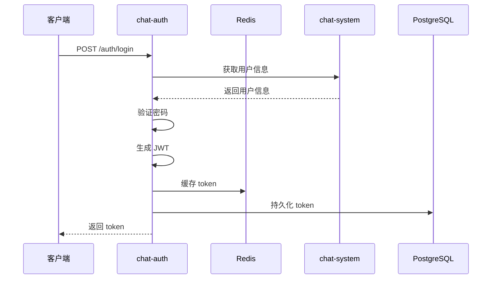

# Chat-Auth 认证服务

基于 Spring Boot + Spring Security + JWT + MyBatis-Plus 实现的认证服务模块。

## 功能特性

- ✅ JWT 令牌认证
- ✅ 密码登录（BCrypt 加密）
- ✅ Token 缓存到 Redis
- ✅ Token 持久化到 PostgreSQL
- ✅ 令牌刷新机制
- ✅ 用户登出
- ✅ 调用 chat-system 获取用户信息（服务解耦）

## 技术栈

- Spring Boot 3.3.7
- Spring Security 6.x
- JWT (JJWT 0.12.3)
- MyBatis-Plus 3.5.5
- PostgreSQL
- Redis
- OpenFeign

## 快速开始

### 1. 数据库初始化

执行 SQL 脚本创建表：

```bash
psql -U postgres -d gemini -f src/main/resources/sql/schema.sql
```

### 2. 配置文件

修改 [`application.yml`](src/main/resources/application.yml:1) 中的数据库和 Redis 配置：

```yaml
spring:
  datasource:
    url: jdbc:postgresql://your-host:5432/gemini
    username: postgres
    password: your-password
  data:
    redis:
      host: your-redis-host
      port: 6379
```

### 3. 启动服务

```bash
mvn spring-boot:run
```

服务将在 `http://localhost:8082` 启动。

## API 接口

### 登录

```http
POST /auth/login
Content-Type: application/json

{
  "username": "admin",
  "password": "123456",
  "deviceType": "web"
}
```

响应：

```json
{
  "code": 200,
  "message": "success",
  "data": {
    "accessToken": "eyJhbGciOiJIUzI1NiIsInR5cCI6IkpXVCJ9...",
    "refreshToken": "eyJhbGciOiJIUzI1NiIsInR5cCI6IkpXVCJ9...",
    "tokenType": "Bearer",
    "expiresIn": 7200,
    "userId": 1,
    "username": "admin"
  }
}
```

### 登出

```http
POST /auth/logout
Authorization: Bearer {accessToken}
```

### 刷新令牌

```http
POST /auth/refresh?refreshToken={refreshToken}
```

### 验证令牌

```http
GET /auth/validate
Authorization: Bearer {accessToken}
```

### 健康检查

```http
GET /auth/health
```

## 架构设计

### 认证流程



### 目录结构

```
chat-auth/
├── src/main/java/com/ai/chat/auth/
│   ├── AuthApplication.java          # 启动类
│   ├── client/                       # Feign 客户端
│   │   ├── UserClient.java           # 调用 chat-system
│   │   └── UserClientFallback.java   # 降级处理
│   ├── config/                       # 配置类
│   │   ├── AuthProperties.java       # 认证配置
│   │   ├── JwtProperties.java        # JWT 配置
│   │   ├── SecurityConfig.java       # Security 配置
│   │   ├── WebConfig.java            # Web 配置
│   │   └── MybatisPlusConfig.java    # MyBatis 配置
│   ├── controller/                   # 控制器
│   │   └── AuthController.java       # 认证接口
│   ├── dto/                          # 数据传输对象
│   │   ├── LoginRequest.java         # 登录请求
│   │   ├── LoginResponse.java        # 登录响应
│   │   └── UserInfo.java             # 用户信息
│   ├── entity/                       # 实体类
│   │   ├── UserToken.java            # 令牌实体
│   │   └── SysUser.java              # 用户实体
│   ├── filter/                       # 过滤器
│   │   └── JwtAuthenticationFilter.java  # JWT 认证过滤器
│   ├── mapper/                       # Mapper 接口
│   │   ├── UserTokenMapper.java      # 令牌 Mapper
│   │   └── SysUserMapper.java        # 用户 Mapper
│   ├── service/                      # 服务接口
│   │   ├── AuthService.java          # 认证服务
│   │   ├── TokenService.java         # 令牌服务
│   │   └── impl/                     # 服务实现
│   └── util/                         # 工具类
│       ├── JwtUtil.java              # JWT 工具
│       └── WebUtil.java              # Web 工具
└── src/main/resources/
    ├── application.yml               # 配置文件
    └── sql/
        └── schema.sql                # 数据库脚本
```

## 核心设计

### 1. 认证与用户分离

chat-auth 不直接查询用户表，而是通过 Feign 调用 chat-system 获取用户信息，实现服务解耦。

### 2. Token 双写机制

- Redis：快速验证，设置过期时间
- PostgreSQL：持久化存储，支持在线用户管理

### 3. 密码加密

使用 BCrypt 算法加密密码，测试用户密码为 `123456`。

### 4. JWT 结构

```json
{
  "userId": 1,
  "username": "admin",
  "type": "access",
  "iss": "chat-auth",
  "iat": 1234567890,
  "exp": 1234575090
}
```

## 配置说明

### JWT 配置

```yaml
jwt:
  secret: your-256-bit-secret-key  # 密钥（生产环境必须修改）
  access-token-expire: 7200        # 访问令牌过期时间（秒）
  refresh-token-expire: 604800     # 刷新令牌过期时间（秒）
  issuer: chat-auth                # 签发者
```

### 认证配置

```yaml
auth:
  permit-urls:                      # 不需要认证的路径
    - /auth/login
    - /auth/register
    - /auth/captcha
    - /error
    - /actuator/**
```

## 依赖服务

### chat-system

需要在 chat-system 中提供以下接口：

```java
// 根据用户名获取用户信息
GET /api/user/internal/username/{username}

// 根据用户ID获取用户信息
GET /api/user/internal/{userId}
```

## 测试

### 测试用户

数据库初始化后会创建两个测试用户：

| 用户名 | 密码 | 说明 |
|--------|------|------|
| admin  | 123456 | 管理员 |
| test   | 123456 | 测试用户 |

### 使用 curl 测试

```bash
# 登录
curl -X POST http://localhost:8082/auth/login \
  -H "Content-Type: application/json" \
  -d '{"username":"admin","password":"123456"}'

# 验证令牌
curl -X GET http://localhost:8082/auth/validate \
  -H "Authorization: Bearer {your-token}"

# 登出
curl -X POST http://localhost:8082/auth/logout \
  -H "Authorization: Bearer {your-token}"
```

## 注意事项

1. **生产环境必须修改 JWT 密钥**
2. **确保 chat-system 服务已启动**
3. **Redis 和 PostgreSQL 必须可访问**
4. **Token 缓存和持久化必须同时成功，否则登录失败**

## 后续扩展

- [ ] 图形验证码登录
- [ ] 短信验证码登录
- [ ] 第三方社交登录
- [ ] 登录失败次数限制
- [ ] IP 锁定机制
- [ ] 在线用户管理
- [ ] 踢人下线功能
